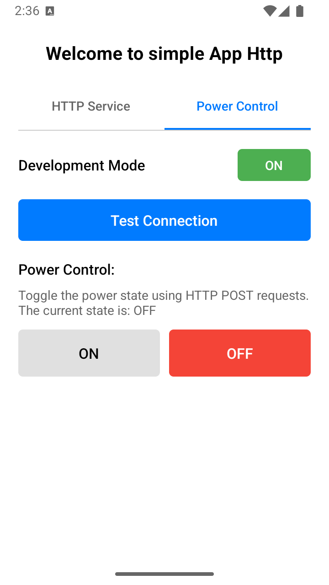

# HTTP Testing App

## Overview

A React Native application for testing HTTP connections and managing power states with development mode features.

## Screenshots

### Welcome Screen


- Simple welcome screen
- Continue button to access main features

### HTTP Service Tab


- IP address and port input
- HTTP method selection (GET, POST, PUT, DELETE)
- Test connection button
- Send request button
- Development mode toggle

### Power Control Tab



- ON/OFF state buttons
- Current state display
- Test connection integration
- Development mode support

## Table of Contents

- Features
- Installation
- Usage
- Development
- API Reference

## Features

### HTTP Service

- IP address validation
- Custom port configuration (default: 80)
- Multiple HTTP methods support
- Connection testing
- Development mode logging
- Response status monitoring

### Power Control

- Visual state indicators
- ON/OFF toggle buttons
- Status feedback
- Automatic connection verification
- Development mode logging

### Development Tools

- Enhanced error messages
- Network request logging
- Connection status tracking
- Visual feedback for all actions
- Debug information display

## Installation

```bash
# Clone the repository
git clone https://github.com/yourusername/http-app.git

# Navigate to project directory
cd http-app

# Install dependencies
npm install
```

## Usage

### HTTP Service Tab

1. Enter target IP address
2. Set port (default: 80)
3. Select HTTP method
4. Test connection
5. Send requests

### Power Control Tab

1. Verify connection
2. Toggle power state (ON/OFF)
3. Monitor status changes

### Development Mode

- Toggle development mode for enhanced logging
- View detailed connection status
- Monitor network requests
- Debug connection issues

## Development

### Project Structure

```
http-app/
├── app/
│   └── httpservice/
│       ├── index.tsx         # Main container
│       ├── HttpServiceTab.tsx    # HTTP testing
│       └── PowerControlTab.tsx   # Power control
├── package.json
└── README.md
```

### Components

#### HttpServiceTab Props

```typescript
type HttpServiceTabProps = {
  ipAddress: string;
  setIpAddress: (ip: string) => void;
  port: string;
  setPort: (port: string) => void;
  selectedMethod: string;
  setSelectedMethod: (method: string) => void;
  connectionStatus: "none" | "success" | "error";
  setConnectionStatus: (status: "none" | "success" | "error") => void;
  renderConnectionStatus: () => React.ReactNode;
  isDevelopmentMode?: boolean;
};
```

#### PowerControlTab Props

```typescript
type PowerControlTabProps = {
  ipAddress: string;
  port: string;
  powerState: string;
  handlePowerToggle: (state: "ON" | "OFF") => Promise<void>;
  isDevelopmentMode: boolean;
};
```

### Running the App

```bash
# Start Metro bundler
npm start

# Run on Android
npm run android

# Run on iOS
npm run ios
```

## API Reference

### Connection Testing

```typescript
const checkConnection = async (ip: string): Promise<boolean>
```

### Power Control

```typescript
const handlePowerToggle = async (state: "ON" | "OFF"): Promise<void>
```

### Development Tools

- Console logging
- Connection status monitoring
- Error tracking
- Network request debugging

## Error Handling

- IP validation
- Connection failures
- Network timeouts
- Server errors

## Contributing

1. Fork the repository
2. Create feature branch (`git checkout -b feature/amazing-feature`)
3. Commit changes (`git commit -m 'Add amazing feature'`)
4. Push to branch (`git push origin feature/amazing-feature`)
5. Open Pull Request

## License

Distributed under the ISC License. See `LICENSE` for more information.

## Contact

Vinicius Souza - [@viniszofx](https://viniccius.com.br)
Project Link: [https://github.com/viniszofx/http-app](https://github.com/viniszofx/http-app)
